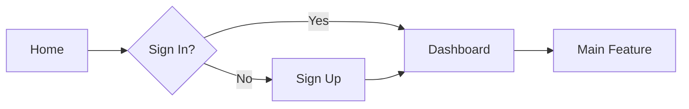

# Product Design Article

Product design articles document design decisions, processes, and insights to share with the community and build your brand.

## Types of Design Articles

### Case Studies
Deep dives into specific design projects.

```markdown
# Redesigning the Checkout Experience

## Background
Our checkout flow had a 45% abandonment rate. We set out to understand why and improve it.

## Research
- Interviewed 50 users
- Analyzed session recordings
- Studied competitor checkouts
- Identified friction points

## Design Process
[Process images]

## Solution
[Final designs with annotations]

## Results
- Abandonment rate: 45% → 28%
- Conversion rate: +15%
- Customer satisfaction: +22%

## Learnings
What we learned and would do differently next time.
```

### Process Articles
Explaining your design workflow and methodologies.

```markdown
# Our Design Sprint Process

## Why Design Sprints?
Quick validation of ideas before building.

## Our 5-Day Sprint

### Monday: Map
- Understand the problem
- Define success metrics
- Map user journey

### Tuesday: Sketch
- Individual brainstorming
- Sketch solutions
- Share ideas

### Wednesday: Decide
- Review sketches
- Vote on solutions
- Create storyboard

### Thursday: Prototype
- Build realistic prototype
- No code required
- Focus on key flows

### Friday: Test
- Interview 5 users
- Observe and learn
- Synthesize findings

## Results
We've run 15 sprints, validating or invalidating ideas before expensive development.
```

### Design System Articles
Documenting design system decisions.

```markdown
# Building Our Button Component

## Requirements
- Multiple variants (primary, secondary, ghost)
- Multiple sizes (sm, md, lg)
- Accessible (WCAG AA)
- Loading states
- Icon support

## Design Tokens
```typescript
const buttonTokens = {
  primary: {
    background: 'blue.600',
    hover: 'blue.700',
    text: 'white'
  },
  secondary: {
    background: 'gray.100',
    hover: 'gray.200',
    text: 'gray.900'
  }
}
```

## Variants
[Visual examples of all variants]

## Accessibility
- Minimum touch target: 44×44px
- Color contrast ratio: 4.5:1
- Focus indicators
- Keyboard navigation

## Usage
```tsx
<Button variant="primary" size="lg">
  Submit
</Button>
```

## Best Practices
- Use primary for main actions
- Limit to one primary per screen
- Provide loading state feedback
```

## Article Structure

### Introduction
Hook readers with the problem or insight.

```markdown
# Why We Removed the Hamburger Menu

Most mobile apps hide navigation behind a hamburger menu. We decided to remove ours. Here's why—and what happened.
```

### Background/Context
Set the stage with relevant information.

```markdown
## Context

Our app is a task management tool used by 500,000 people daily. Navigation includes:
- Tasks
- Projects
- Calendar
- Settings

We noticed users rarely explored beyond the task list.
```

### Problem Statement
Clearly define what you're solving.

```markdown
## The Problem

Our analytics showed:
- Only 15% of users visited Projects
- Calendar was used by just 8%
- Settings had 40% findability score

The hamburger menu was hiding these features.
```

### Process
Show your work and thinking.

```markdown
## Our Approach

### 1. Research
- User interviews (n=30)
- Session recordings analysis
- Competitor analysis

### 2. Hypotheses
- Users don't know features exist
- Hamburger adds friction
- Tab bar would increase discoverability

### 3. Design Iterations
[Show design explorations]

### 4. Testing
- Prototype testing
- A/B test plan
```

### Solution
Present your design with visuals.

```markdown
## The Solution

We replaced the hamburger menu with a bottom tab bar featuring four main sections.

[Before/After comparison images]

### Key Decisions

**1. Bottom Placement**
More reachable on large phones

**2. Four Tabs Maximum**
Prevents overcrowding

**3. Persistent Navigation**
Always visible, no taps to reveal

**4. Active Indicators**
Clear current location
```

### Results
Share outcomes with metrics.

```markdown
## Results

After 4 weeks:
- Projects usage: 15% → 42%
- Calendar usage: 8% → 31%
- User engagement: +28%
- Session duration: +15%

User feedback:
"Finally! I didn't know half these features existed."
```

### Learnings
Reflect on insights and takeaways.

```markdown
## What We Learned

### What Worked
- Bottom tabs increased discoverability
- Persistent navigation improved UX
- Users explored more features

### What We'd Do Differently
- Test tab bar earlier
- Consider 5 tabs (we have space)
- Animate transitions better

### General Insights
- Don't hide core features
- Test assumptions with data
- Small changes can have big impact
```

## Writing Tips

### Show Your Work
```markdown
❌ "We decided on a card-based design."

✅ "We explored three approaches:
1. List view (familiar but boring)
2. Card view (visual but space-inefficient)
3. Hybrid (best of both)

We chose hybrid because..."
```

### Use Visuals
```markdown
Every 2-3 paragraphs, include:
- Screenshots
- Diagrams
- Before/after comparisons
- User flow diagrams
- Data visualizations
```

### Tell a Story
```markdown
❌ Feature list:
- Added dark mode
- Improved performance
- Fixed bugs

✅ Story:
"Users told us they designed late at night. 
The bright interface hurt their eyes. 
We knew we had to add dark mode..."
```

### Be Specific
```markdown
❌ "We improved performance significantly."

✅ "We reduced load time from 4.2s to 1.8s—a 57% improvement."
```

### Include Challenges
```markdown
## Challenges

### Technical Constraints
Our legacy code made animations difficult.

### Business Requirements
Marketing wanted the redesign for a product launch.

### User Feedback
Early testers found the new design confusing.

### How We Overcame Them
- Refactored animation system
- Adjusted timeline with stakeholders
- Iterated based on feedback
```

## Visual Content

### Before/After Comparisons
```
┌─────────────┬─────────────┐
│   BEFORE    │    AFTER    │
├─────────────┼─────────────┤
│ [Old UI]    │ [New UI]    │
│             │             │
│ Problems:   │ Improvements:│
│ - Cluttered │ - Clean     │
│ - Confusing │ - Clear     │
└─────────────┴─────────────┘
```

### User Flow Diagrams


### Design Iterations
```
Iteration 1   Iteration 2   Iteration 3   Final
[Image]       [Image]       [Image]       [Image]
```

### Annotations
```
┌─────────────────────────────┐
│  [Screenshot with arrows]   │
│                             │
│  → Improved contrast        │
│  → Larger touch targets     │
│  → Clearer labels           │
└─────────────────────────────┘
```

## Article Templates

### Redesign Case Study
```markdown
# [Feature] Redesign

## Overview
- Timeline
- Team
- Role
- Tools

## Challenge
What problem were we solving?

## Research
How did we understand the problem?

## Design Process
How did we solve it?

## Solution
What did we build?

## Results
What impact did it have?

## Reflection
What did we learn?
```

### Design Decision
```markdown
# Why We [Made This Decision]

## Context
Background information

## The Question
What were we deciding?

## Options Considered
- Option A: Pros/cons
- Option B: Pros/cons
- Option C: Pros/cons

## Decision
What we chose and why

## Results
How it turned out

## Would We Do It Again?
Hindsight perspective
```

### Design System Component
```markdown
# [Component Name]

## Purpose
Why this component exists

## Anatomy
Parts and structure

## Variants
Different versions

## States
Interactive states

## Accessibility
A11y considerations

## Usage Guidelines
When and how to use

## Examples
Real-world usage
```

## Publishing Platforms

### Personal Blog
- Full control
- Build your brand
- SEO benefits

### Medium
- Built-in audience
- Easy to publish
- Good distribution

### Dev.to
- Tech-focused community
- Developer audience
- Great engagement

### Company Blog
- Company visibility
- Professional credibility
- Broader reach

## Promotion

### Social Media
```markdown
Twitter/X thread structure:
1/ Hook tweet with key insight
2/ Problem statement
3/ Solution preview
4/ Results
5/ Key learning
6/ Link to full article
```

### LinkedIn
```markdown
Professional tone:
- Business impact
- Process insights
- Team collaboration
- Measurable results
```

### Design Communities
- Dribbble
- Behance
- Designer News
- Sidebar

## SEO for Design Articles

### Title Optimization
```markdown
❌ "A Redesign"
✅ "Redesigning Checkout: How We Reduced Cart Abandonment by 40%"
```

### Meta Description
```markdown
<meta name="description" content="A deep dive into our checkout redesign process, including research, design iterations, and results. Learn how we reduced abandonment from 45% to 28%." />
```

### Image Alt Text
```html
<!-- ❌ -->


<!-- ✅ -->

```

## Measuring Success

### Metrics to Track
- **Views**: How many people read it
- **Engagement**: Time on page, scroll depth
- **Social shares**: Twitter, LinkedIn
- **Comments**: Discussion quality
- **Backlinks**: Other sites linking to it

### Goals
```markdown
Short-term:
- 1,000 views in first week
- 50+ social shares
- 10+ meaningful comments

Long-term:
- Personal brand building
- Portfolio piece
- Thought leadership
- Job opportunities
```

## Common Mistakes

### ❌ Too Much Jargon
"We leveraged our ideation to synthesize the user's mental model..."

### ❌ No Context
Jumping into the solution without explaining the problem.

### ❌ Only Showing Final Design
Not showing the process and iterations.

### ❌ No Metrics
Making claims without data to back them up.

### ❌ Too Long
10,000-word article that loses readers.

## Best Practices

✅ **Start with why** - Make readers care
✅ **Show your process** - Don't just show the final result
✅ **Use real data** - Back up claims with metrics
✅ **Include challenges** - Be honest about difficulties
✅ **Make it scannable** - Use headings, lists, images
✅ **Edit ruthlessly** - Every word should earn its place
✅ **Get feedback** - Have others review before publishing
✅ **Promote actively** - Share on relevant platforms

## Example Article Outline

```markdown
# Redesigning Our Mobile Navigation

## Introduction (200 words)
Hook: "87% of our users never discovered our app's best features. Here's how we fixed that."

## Background (300 words)
- App context
- Navigation before
- Usage data

## The Problem (400 words)
- Low feature discoverability
- High cognitive load
- User feedback

## Research (500 words)
- User interviews
- Analytics analysis
- Competitor review

## Design Process (800 words)
- Initial sketches
- Three concepts
- Testing & iteration
- Final design

## Solution (600 words)
- Design decisions
- Interaction details
- Accessibility

## Implementation (300 words)
- Technical considerations
- Rollout strategy

## Results (400 words)
- Metrics before/after
- User feedback
- Business impact

## Learnings (300 words)
- What worked
- What didn't
- What's next

## Conclusion (100 words)
Key takeaways

---

Total: ~4,000 words, 15-20 images
Reading time: ~15 minutes
```

