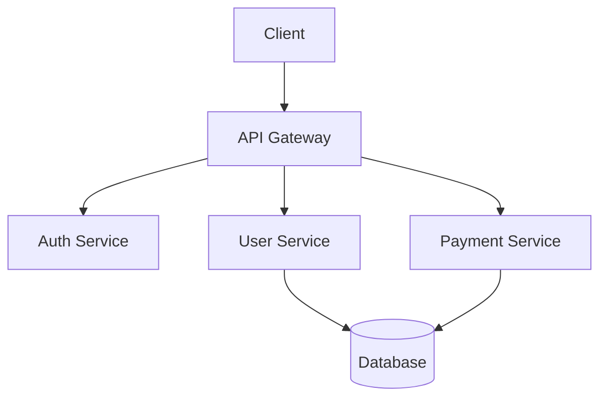
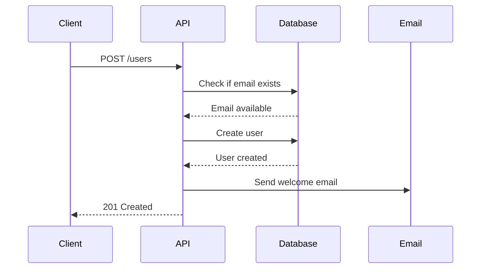
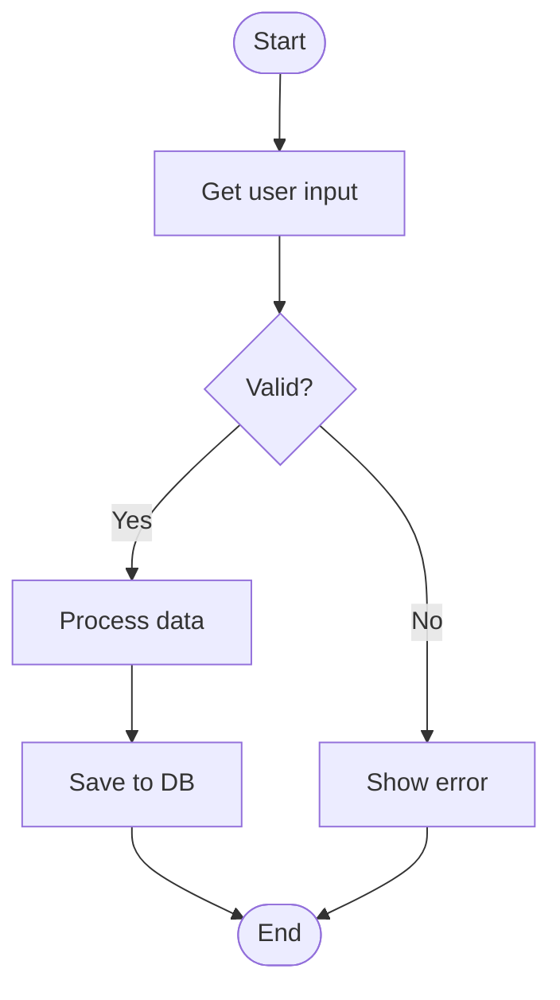

# Technical Documentation

Good documentation is essential for maintainability, onboarding, and knowledge sharing.

## Types of Documentation

### API Documentation
Documents endpoints, parameters, and responses.

```typescript
/**
 * Retrieves user by ID
 * 
 * @route GET /api/users/:id
 * @param {string} id - User ID
 * @returns {User} User object
 * @throws {404} User not found
 * @throws {500} Server error
 * 
 * @example
 * GET /api/users/123
 * Response: {
 *   "id": "123",
 *   "name": "John Doe",
 *   "email": "john@example.com"
 * }
 */
app.get('/api/users/:id', async (req, res) => {
  // Implementation
})
```

### Code Documentation
Explains what code does and why.

```typescript
/**
 * Calculates discounted price based on user tier and promotion
 * 
 * Applies tier discounts first, then promotional discounts.
 * Premium users receive 20% off, while first-time users get 10% off.
 * Promotional codes are applied on top of tier discounts.
 * 
 * @param basePrice - Original price before discounts
 * @param userTier - User's membership tier (premium | standard | free)
 * @param promoCode - Optional promotional code
 * @returns Final price after all discounts
 * 
 * @example
 * ```ts
 * calculatePrice(100, 'premium', 'SAVE10')
 * // Returns: 72 (100 - 20% tier - 10% promo)
 * ```
 */
export function calculatePrice(
  basePrice: number,
  userTier: UserTier,
  promoCode?: string
): number {
  let price = basePrice
  
  // Apply tier discount
  if (userTier === 'premium') {
    price *= 0.8
  } else if (userTier === 'first-time') {
    price *= 0.9
  }
  
  // Apply promotional discount
  if (promoCode) {
    const discount = getPromoDiscount(promoCode)
    price *= (1 - discount)
  }
  
  return price
}
```

### Architecture Documentation
Describes system design and structure.

```markdown
# System Architecture

## Overview
Our system follows a microservices architecture with the following components:

## Components

### API Gateway
- Entry point for all client requests
- Handles authentication
- Routes to appropriate services
- Rate limiting

### User Service
- Manages user data
- Authentication and authorization
- Profile management

### Payment Service
- Processes payments
- Manages subscriptions
- Handles refunds

### Notification Service
- Sends emails
- Push notifications
- SMS messaging

## Data Flow
```
Client → API Gateway → [User Service | Payment Service | Notification Service]
                     ↓
                  Database
```

## Technology Stack
- **Backend**: Node.js, Express
- **Database**: PostgreSQL
- **Cache**: Redis
- **Queue**: RabbitMQ
- **Monitoring**: DataDog
```

### README Files
Project overview and getting started guide.

```markdown
# Project Name

Brief description of what this project does.

## Features
- Feature 1
- Feature 2
- Feature 3

## Getting Started

### Prerequisites
- Node.js 18+
- pnpm 8+
- PostgreSQL 14+

### Installation
```bash
# Clone repository
git clone https://github.com/org/project.git

# Install dependencies
pnpm install

# Set up environment variables
cp .env.example .env

# Run migrations
pnpm db:migrate

# Start development server
pnpm dev
```

### Environment Variables
| Variable | Description | Required |
|----------|-------------|----------|
| `DATABASE_URL` | PostgreSQL connection string | Yes |
| `REDIS_URL` | Redis connection string | Yes |
| `API_KEY` | External API key | No |

## Development

### Running Tests
```bash
pnpm test          # Run all tests
pnpm test:watch    # Watch mode
pnpm test:coverage # With coverage
```

### Building
```bash
pnpm build
```

## Deployment
See [DEPLOYMENT.md](./DEPLOYMENT.md) for deployment instructions.

## Contributing
See [CONTRIBUTING.md](./CONTRIBUTING.md) for contribution guidelines.

## License
MIT
```

## Documentation Best Practices

### Write for Your Audience
```typescript
// ❌ Too technical for beginners
/**
 * Implements the Boyer-Moore string matching algorithm 
 * with O(n/m) best case time complexity
 */

// ✅ Clear for general audience
/**
 * Searches for a pattern in a text string efficiently.
 * Returns the position where the pattern was found, or -1 if not found.
 * 
 * @example
 * findPattern("hello world", "world") // Returns: 6
 */
```

### Be Concise
```typescript
// ❌ Too verbose
/**
 * This function takes an array of numbers as its first parameter
 * and then it will iterate through all of the numbers in the array
 * and add them all together and then return the total sum
 */

// ✅ Concise
/**
 * Calculates the sum of all numbers in an array
 */
```

### Use Examples
```typescript
/**
 * Formats a date for display
 * 
 * @example
 * formatDate(new Date('2024-01-15'))
 * // Returns: "January 15, 2024"
 * 
 * @example
 * formatDate(new Date('2024-01-15'), 'short')
 * // Returns: "01/15/24"
 */
function formatDate(date: Date, format: 'long' | 'short' = 'long'): string {
  // Implementation
}
```

### Keep It Updated
```typescript
// ✅ Include version information
/**
 * User authentication handler
 * 
 * @since 2.0.0
 * @deprecated since 3.0.0 - Use authenticateWithToken instead
 */
function authenticate(username: string, password: string) {
  // Implementation
}
```

## JSDoc Comments

### Functions
```typescript
/**
 * Creates a new user account
 * 
 * @param email - User's email address
 * @param password - User's password (will be hashed)
 * @param options - Additional options
 * @param options.sendWelcomeEmail - Whether to send welcome email
 * @param options.role - User's role (defaults to 'user')
 * @returns Promise resolving to created user
 * @throws {ValidationError} If email is invalid
 * @throws {ConflictError} If email already exists
 */
async function createUser(
  email: string,
  password: string,
  options?: {
    sendWelcomeEmail?: boolean
    role?: 'admin' | 'user'
  }
): Promise<User> {
  // Implementation
}
```

### Interfaces and Types
```typescript
/**
 * Represents a user in the system
 */
interface User {
  /** Unique identifier */
  id: string
  
  /** User's email address (must be unique) */
  email: string
  
  /** Hashed password */
  password: string
  
  /** User's role */
  role: 'admin' | 'user' | 'guest'
  
  /** Account creation timestamp */
  createdAt: Date
  
  /** Last login timestamp */
  lastLoginAt?: Date
}
```

### Classes
```typescript
/**
 * Manages user authentication and sessions
 * 
 * @example
 * ```ts
 * const auth = new AuthService(db, redis)
 * const user = await auth.login(email, password)
 * ```
 */
export class AuthService {
  /**
   * Creates a new AuthService instance
   * 
   * @param db - Database connection
   * @param cache - Redis cache connection
   */
  constructor(
    private db: Database,
    private cache: Redis
  ) {}
  
  /**
   * Authenticates user with email and password
   * 
   * @param email - User's email
   * @param password - User's password
   * @returns Promise resolving to authenticated user
   * @throws {AuthenticationError} If credentials are invalid
   */
  async login(email: string, password: string): Promise<User> {
    // Implementation
  }
}
```

## Markdown Documentation

### Structure
```markdown
# Page Title

Brief introduction paragraph.

## Section 1

Content for section 1.

### Subsection 1.1

More detailed content.

## Section 2

Content for section 2.
```

### Code Blocks
````markdown
```typescript
// Code example
function example() {
  return 'hello'
}
```
````

### Tables
```markdown
| Feature | Description | Status |
|---------|-------------|--------|
| Auth    | User login  | ✅ Done |
| Payment | Checkout    | 🚧 WIP |
| Search  | Full-text   | 📋 Todo |
```

### Links
```markdown
[Link text](https://example.com)
[Internal link](./other-page.md)
[Section link](#section-name)
```

### Images
```markdown

```

## API Documentation

### OpenAPI/Swagger
```yaml
openapi: 3.0.0
info:
  title: User API
  version: 1.0.0

paths:
  /users:
    get:
      summary: List users
      parameters:
        - name: limit
          in: query
          schema:
            type: integer
            minimum: 1
            maximum: 100
            default: 20
      responses:
        '200':
          description: Success
          content:
            application/json:
              schema:
                type: array
                items:
                  $ref: '#/components/schemas/User'

components:
  schemas:
    User:
      type: object
      properties:
        id:
          type: string
        name:
          type: string
        email:
          type: string
          format: email
```

## Diagrams

### Architecture Diagrams


### Sequence Diagrams


### Flow Charts


## Documentation Tools

- **JSDoc**: JavaScript documentation
- **TypeDoc**: TypeScript documentation
- **Storybook**: Component documentation
- **Docusaurus**: Documentation website
- **Swagger/OpenAPI**: API documentation
- **Mermaid**: Diagrams
- **VitePress**: Static site generator

## Maintaining Documentation

### Keep It Close to Code
```
src/
  components/
    Button/
      Button.tsx
      Button.test.tsx
      Button.stories.tsx  ← Component examples
      README.md           ← Component docs
```

### Automate Where Possible
```typescript
// Generate API docs from types
import { generateSchema } from 'typescript-json-schema'

// Generate OpenAPI spec
import { generateOpenApi } from '@ts-rest/open-api'
```

### Review Documentation
Include documentation in code reviews:
- Is it clear?
- Is it accurate?
- Are examples helpful?
- Is anything missing?

## Documentation Checklist

- [ ] README with setup instructions
- [ ] API documentation with examples
- [ ] Architecture overview
- [ ] Contributing guidelines
- [ ] Code comments for complex logic
- [ ] Type definitions with descriptions
- [ ] Deployment instructions
- [ ] Troubleshooting guide
- [ ] Change log

## Common Mistakes

### ❌ Outdated Documentation
Keep docs in sync with code.

### ❌ No Examples
Show, don't just tell.

### ❌ Too Much Detail
Focus on what users need to know.

### ❌ Assuming Knowledge
Explain acronyms and concepts.

### ❌ Poor Organization
Use clear hierarchy and structure.

